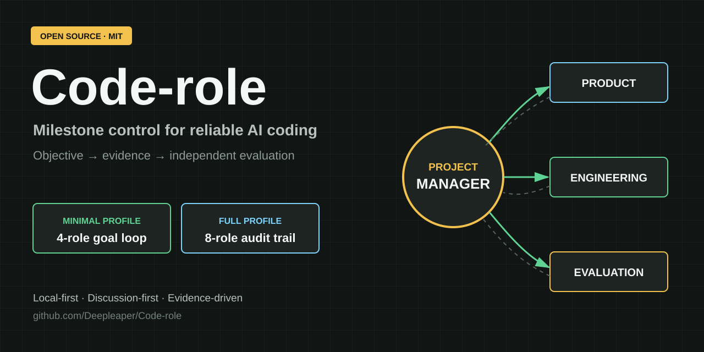
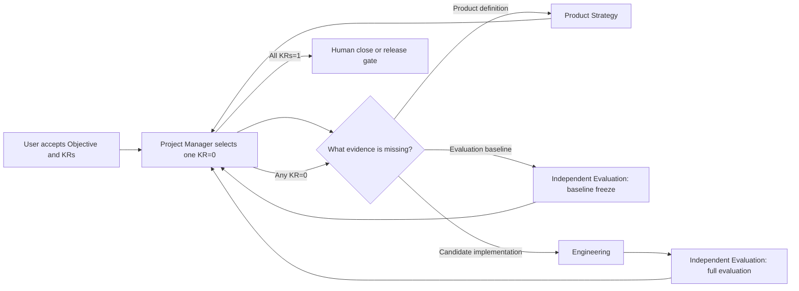
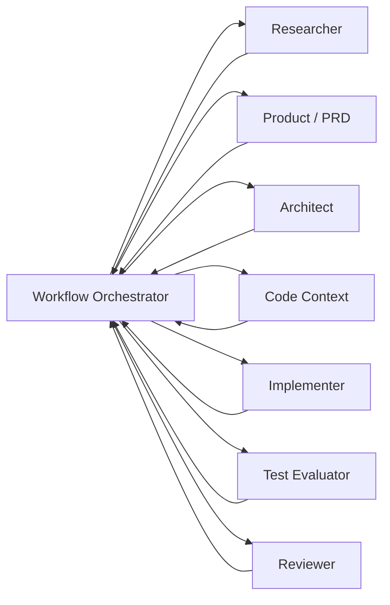

# Code-role

<p align="center">
  
</p>

<p align="center">
  <a href="https://github.com/Deepleaper/Code-role/actions/workflows/tests.yml"></a>
  <a href="https://github.com/Deepleaper/Code-role/releases"></a>
  <a href="LICENSE"></a>
  <a href="https://github.com/Deepleaper/Code-role/stargazers"></a>
</p>

**Control one software milestone with explicit ownership, objective evidence, and independent evaluation.**

**用明确责任、客观证据和独立评估控制一个软件里程碑。**

Code-role is a local operating system for reliable AI coding. It keeps Codex roles focused on observable milestone outcomes and prevents research, documents, code activity, tests written, or workflow ceremony from being mistaken for delivery.

Code-role 是一套面向可靠 AI 编程的本地工作机制。它让 Codex 角色始终围绕可观测的里程碑结果工作，并防止把调研、文档、代码活动、“写了测试”或流程动作误判成交付。

It provides two official operating profiles:

- **Minimal Profile:** four workstations, the smallest complete milestone-control unit.
- **Full Profile:** eight roles, separated professional ownership with versioned packet evidence and the same artifact-first dialogue control.

Code-role 是一个用于控制 Codex 编程交付的本地角色系统，正式提供两套配置：

- **四角色最小版：** 能完整控制一个里程碑的最小单元。
- **八角色完整版：** 专业职责进一步拆分，并保留版本化 packet 证据链。

Neither profile is deprecated. Choose one profile for each milestone according to complexity, risk, and audit needs.

两套配置都不是旧版。每个 milestone 根据复杂度、风险和审计要求选择其中一套。

## 60-Second Start / 60 秒启动

```bash
git clone https://github.com/Deepleaper/Code-role.git
cd Code-role
python3 scripts/init_loop_workflow.py "/absolute/path/to/your-project" \
  --project-name "Your Project"
python3 scripts/init_loop_workflow.py "/absolute/path/to/your-project" --check
```

Then open the generated `code-role/role-instance-prompts/project-manager.md`, define one Objective with binary outcome Key Results, and let the Project Manager route the owner of the first failed or missing evidence item.

然后打开生成的 `code-role/role-instance-prompts/project-manager.md`，定义一个 Objective 和可二值验收的结果型 Key Results，由项目经理调度第一个失败或缺失证据的责任工位。

See the [complete four-workstation walkthrough](examples/minimal-goal-loop/README.md) to inspect one milestone from PM Assignment through independent evaluation and closure.

查看[四工位完整闭环示例](examples/minimal-goal-loop/README.md)，了解一个 milestone 如何从项目经理任务书、工程交付、独立评估一直走到关闭。

## What Makes It Different / 核心差异

| Principle | Code-role behavior |
| --- | --- |
| One accountable outcome | The Project Manager owns one accepted Objective and its binary KRs. |
| Outcome KRs only | Delivery KRs describe observable user, business, product, or runtime outcomes; process artifacts are methods or evidence. |
| One failed evidence item at a time | Every assignment targets one exact reason a current KR remains `0`, not an open-ended role agenda. |
| Evidence before status | Unrun checks, missing evidence, and partial results remain `0`. |
| Independent acceptance | Engineering produces candidate evidence; Independent Evaluation decides observed pass/fail. |
| One primary artifact | Every role has one required professional deliverable; annexes and packet metadata are optional. |
| Local control plane | Generated `code-role/` files stay outside product runtime and target-project releases by default. |

## Real Project Cases / 真实项目案例

Code-role was shaped by two private, real-world AI engineering projects. The value of these cases is not that both milestones are complete. Neither case is presented as complete. The value is that Code-role kept strong partial results from becoming unsupported product claims.

Code-role 来自两个真实的私有 AI 工程项目。这两个案例的价值不是“都成功完成了”，我们也没有把它们包装成完成案例。真正的价值在于：即使已经取得大量局部成果，Code-role 仍然阻止团队把不完整证据扩大成产品结论。

| Case | Evidence that looked strong | What still remained `0` | Control value |
| --- | --- | --- | --- |
| [DeepBrain memory runtime](docs/case-studies/deepbrain.md) | 1,750 unit tests, 142 frontend/runtime tests, S50 `50/50`, LongMemEval-S `499/500`, and `100/100` grounded source joins | Fair comparator, representative raw benchmark reruns, repair proof, clean reproducibility, and production cost/SLO evidence | Independent Evaluation held the milestone and Reviewer route at `0` instead of turning a `73/100` partial result into “production ready.” |
| [Leaper Agent enterprise runtime](docs/case-studies/leaper-agent.md) | A detailed Hermes comparison plan and a professional-looking evaluation baseline | Real task artifacts, isolated holdout, committed grader mechanism, concrete same-condition runtime, and canonical integrity evidence | The Project Manager rejected the first baseline and kept Engineering blocked until evaluation became executable rather than declarative. |

Read the complete [two-case launch story](docs/promotion/TWO-CASE-LAUNCH-STORY.md).

## Why / 为什么

AI coding work drifts when progress is measured by activity instead of accepted product evidence. A polished document, a large diff, or a passing local command does not prove that the milestone is complete.

当 AI 编程以“做了多少事情”代替“是否获得已接受的产品证据”时，目标就会漂移。漂亮文档、大量代码或一条本地通过命令，都不能单独证明里程碑完成。

Code-role keeps four rules stable across both profiles:

1. The Project Manager owns the milestone result.
2. Professional roles own professional conclusions.
3. Required completion evidence is objective and binary.
4. Implementation cannot approve itself; independent evaluation is required.

Code-role 在两套配置中都坚持四条规则：

1. 项目经理对里程碑结果负责。
2. 专业角色对专业结论负责。
3. 完成证据必须客观、可验证，并按二值判断。
4. 实现不能自我验收，必须经过独立评估。

## Choose A Profile / 选择配置

| Decision | Minimal Profile / 四角色最小版 | Full Profile / 八角色完整版 |
| --- | --- | --- |
| Best for | Clear product direction, bounded engineering work, normal iteration speed | Complex or high-risk milestones, unresolved research/architecture, formal audit needs |
| 适用场景 | 产品方向清楚、工程范围可控、需要快速迭代 | 复杂或高风险 milestone、研究和架构不确定、需要完整审计 |
| Roles | 4 workstations | 8 separate roles |
| Control state | One `milestone-board.md` | Milestone contract, Orchestrator state, and accepted packet pointers |
| Handoff | One role-specific assignment and one short return | One role-specific assignment, professional packet, and short return |
| Evaluation | Independent Evaluation workstation | Test Evaluator plus final Reviewer audit |
| Process weight | Low | High |

Use the **Minimal Profile** when four workstations can preserve professional quality without losing necessary context. Use the **Full Profile** when separating research, product, architecture, code context, evaluation, and audit reduces meaningful risk.

当四个工位足以保持专业质量且不会丢失必要上下文时，使用**四角色最小版**。当拆开研究、产品、架构、代码上下文、评估和审计能够实质降低风险时，使用**八角色完整版**。

Do not switch profiles silently in the middle of a milestone. A profile change requires an explicit Project Manager proposal and user acceptance.

同一 milestone 中不要静默切换配置。配置切换必须由项目经理明确提出，并由用户确认。

## Minimal Profile / 四角色最小版

| Workstation | Responsibility |
| --- | --- |
| Project Manager / 项目经理 | Defines Objective and binary KRs, selects one current `KR=0`, routes work, accepts evidence, and closes the milestone |
| Product Strategy / 产品策略 | Resolves user value, behavior, scope, thresholds, and claim boundaries |
| Engineering / 工程 | Performs engineering research, architecture and context work when needed, implementation, tests, and candidate evidence |
| Independent Evaluation / 独立评估 | Freezes the evaluation baseline and independently runs the complete required evaluation |

Research is a capability inside Product Strategy and Engineering. Architecture and code-context mapping are Engineering modes. They are not mandatory stages.

研究属于产品策略和工程能力。架构与代码上下文映射属于工程工作模式，不是必须依次经过的阶段。



There is no fixed role chain. Each assignment targets one exact failed or missing evidence item keeping an accepted outcome KR at `0`. A complete PM Assignment starts the selected workstation immediately.

不存在固定角色链。每份任务书只针对一个主要 `KR=0` 及其同一组必要检查。工位收到完整 PM Assignment 后直接开始工作。

### Initialize Minimal Profile / 初始化四角色最小版

```bash
python scripts/init_loop_workflow.py "/absolute/path/to/project" \
  --project-name "Project Name"
```

Update role rules while preserving the current milestone board and work attachments:

```bash
python scripts/init_loop_workflow.py "/absolute/path/to/project" \
  --project-name "Project Name" \
  --sync
```

Validate:

```bash
python scripts/init_loop_workflow.py "/absolute/path/to/project" --check
```

Minimal Profile documentation:

- [Goal loop guide / 四角色说明](docs/loop/README.md)
- [Goal loop contract / 目标闭环协议](docs/loop/LOOP.md)
- [Project Manager](docs/loop/roles/project-manager.md)
- [Product Strategy](docs/loop/roles/product-strategy.md)
- [Engineering](docs/loop/roles/engineering.md)
- [Independent Evaluation](docs/loop/roles/independent-evaluation.md)

## Full Profile / 八角色完整版

| Role | Responsibility |
| --- | --- |
| Workflow Orchestrator / 项目经理 | Owns milestone alignment, authoritative state, role routing, and final closure |
| Researcher / 研究员 | Produces repository research, external research, evidence maps, risks, and unknowns |
| Product / PRD / 产品经理 | Defines product value, scope, non-goals, acceptance criteria, and claim boundaries |
| Architect / 架构师 | Defines architecture contracts, boundaries, interfaces, data flow, and technical risks |
| Code Context / 上下文工程师 | Maps architecture to exact files, functions, fields, tests, artifacts, and implementation constraints |
| Implementer / 实现工程师 | Changes approved project files and produces implementation and verification evidence |
| Test Evaluator / 测试评估师 | Freezes or consumes the evaluation SOP and independently evaluates the complete required scope |
| Reviewer / 复核审计 | Audits Orchestrator and every final role output against the original milestone and evaluation baseline |

The Full Profile is outcome-first and evidence-based. Each professional role has one configured conversation, starts from one complete role-specific assignment, consumes explicit authoritative inputs, and writes one required primary professional artifact for Project Manager review. Versioned packet metadata and annexes remain optional audit support.

八角色完整版以结果和证据为核心。每个专业角色使用独立对话，消费明确的权威输入，并产出一份必需的主交付物交由项目经理审阅。版本化 packet 元数据和附件只是可选的审计支持。

Use one configured Codex role instance per role. Do not run the Full Profile by switching roles inside one conversation.

每个角色分别配置一个独立角色实例，不要在一个对话中切换身份来运行八角色完整版。



The diagram shows control returning to Project Manager after every professional role. Named chains remain planning presets; evidence and blocker ownership determine the actual next role.

流程图表示每个专业角色完成后都返回项目经理检查。实际可按任务选择 `full-chain`、`mini-chain`、`patch-chain`、`docs-only-chain` 或 `research-only`。

### Initialize Full Profile / 初始化八角色完整版

Preview:

```bash
python scripts/init_project_workflow.py \
  --target "/absolute/path/to/project" \
  --project-name "Project Name" \
  --initial-milestone workflow-bootstrap \
  --initial-chain full-chain
```

Write:

```bash
python scripts/init_project_workflow.py \
  --target "/absolute/path/to/project" \
  --project-name "Project Name" \
  --initial-milestone workflow-bootstrap \
  --initial-chain full-chain \
  --write
```

Full Profile documentation:

- [Eight-role workflow / 八角色工作流](docs/workflow/README.md)
- [Role configuration guide](docs/workflow/role-configuration-guide.md)
- [Milestone contract](docs/workflow/milestone-contract.md)
- [Role completion contract](docs/workflow/role-completion-contract.md)
- [Evaluation SOP](docs/workflow/evaluation-sop.md)
- [Project bootstrap](docs/workflow/project-bootstrap.md)
- [Role instance setup](docs/workflow/role-instance-setup.md)
- [Project practices](docs/workflow/project-practices.md)
- [Optional state index](docs/workflow/state-index.md)
- [Git operation policy](docs/workflow/git-operation-policy.md)

## Shared Completion Standard / 共同完成标准

- `0` means the required result has not been independently proven.
- `1` means every frozen pass condition has acceptable evidence.
- An unrun required check is `0`.
- A residual item becomes a new accepted requirement, an explicit non-goal, or remains unresolved at `0`.
- Evaluation and review gates are binary. `partial_pass` and `pass_with_residual_risk` are invalid gate states.
- Only Project Manager updates milestone status.
- Only the user accepts Objective/KR changes, evaluation-threshold changes, budget expansion, and irreversible release actions.

## Local Project Boundary / 本地项目边界

Generated target-project `code-role/` directories are local role-control assistance:

- not product runtime content;
- not part of customer delivery bundles;
- not included in release artifacts;
- not committed to the target project by default.

Both initializers add `code-role/` to the target repository's local `.git/info/exclude` when a Git repository already exists. They do not change the tracked `.gitignore`.

如果目标目录已经是 Git 仓库，两套初始化器都会把 `code-role/` 写入本地 `.git/info/exclude`，不会修改仓库跟踪的 `.gitignore`。

## Product Documentation / 产品文档

- [English PRD](docs/product/prd.md)
- [中文产品需求对齐稿](docs/product/prd.zh-CN.md)
- [中文 HTML 说明与初始化指南](docs/product/code-role-workflow-guide.zh-CN.html)
- [v0.4.0 release: less process, stronger outcomes / v0.4.0 发布说明](docs/promotion/V0.4.0-RELEASE.md)
- [Minimal target example](examples/minimal-target/README.md)
- [Complete goal-loop walkthrough / 完整目标闭环示例](examples/minimal-goal-loop/README.md)
- [Real project cases / 真实项目案例](docs/case-studies/README.md)

## Community / 社区

- Ask implementation questions or share a real workflow in [GitHub Discussions](https://github.com/Deepleaper/Code-role/discussions).
- Report reproducible problems through [GitHub Issues](https://github.com/Deepleaper/Code-role/issues).
- See the public [Roadmap](ROADMAP.md), [Changelog](CHANGELOG.md), and [Contributing Guide](CONTRIBUTING.md).

If Code-role makes an AI coding milestone more predictable, star the repository and share the evidence from your first completed loop. Real project feedback is more valuable than generic promotion.

如果 Code-role 让你的 AI 编程里程碑变得更可控，欢迎 Star，并分享第一个真实闭环的证据。真实项目反馈比泛泛宣传更有价值。

## Development / 开发

```bash
python -m pytest
```

Code-role is released under the [MIT License](LICENSE).
