# Code-role

**One milestone. One current KR. One professional action. One independent evaluation.**

**一个里程碑、一个当前 KR、一次专业执行、一次独立评估。**

Code-role is a local, OKR-driven evidence loop for controlling Codex-assisted software delivery. It keeps the Project Manager responsible for the outcome, lets professional workstations operate independently, and prevents unverified activity from being reported as milestone completion.

Code-role 是一个本地、OKR 驱动的 Codex 编程交付证据闭环。项目经理对最终结果负责，专业工位独立工作，没有经过验证的活动不能被写成里程碑完成。

## Why / 为什么

Long role chains tend to optimize workflow artifacts instead of the product goal. A role can produce a polished report, valid manifest, or large code diff while the milestone is still not complete.

过长的角色链容易优化流程文件，而不是产品目标。一个角色可以写出漂亮报告、合法 manifest 或大量代码，但里程碑仍然没有完成。

Code-role v0.2 replaces the default eight-role packet chain with a bounded goal loop:

- one user-accepted Objective;
- no more than five binary Key Results;
- exactly one `KR=0` selected per iteration;
- dynamic routing instead of a fixed role chain;
- frozen evaluation criteria before implementation optimization;
- independent targeted and regression evaluation;
- a three-attempt default stop rule;
- human gates only for goal changes, budget expansion, and irreversible actions.

## Four Workstations / 四个工位

| Workstation | Owns |
| --- | --- |
| Project Manager / 项目经理 | Objective, KR definitions, current KR, routing, iteration budget, milestone closure |
| Product Strategy / 产品策略 | User value, product behavior, scope, thresholds, claim boundary |
| Engineering / 工程 | Engineering research, necessary design, implementation, tests, candidate evidence |
| Independent Evaluation / 独立评估 | Evaluation baseline, complete required SOP, independent evidence, binary observed results |

Research is a capability inside Product Strategy and Engineering. Architecture and context engineering are Engineering modes. They are not mandatory stages.

研究属于产品策略和工程能力。架构与上下文工程属于工程工作模式，不是必须经过的独立环节。

## Goal Loop / 目标闭环

```mermaid
flowchart LR
    U["User confirms Objective and KRs"] --> PM["Project Manager selects one KR=0"]
    PM --> D{"Product meaning clear?"}
    D -- "No" --> P["Product Strategy"]
    P --> PM
    D -- "Yes, baseline missing" --> V0["Independent Evaluation freezes SOP"]
    V0 --> PM
    D -- "Yes, actionable" --> E["Engineering"]
    E --> V["Independent Evaluation"]
    V -- "Fail with evidence" --> PM
    V -- "Pass with evidence" --> PM
    PM -- "Any accepted KR=0" --> D
    PM -- "All accepted KRs=1" --> H["Human close, merge, or release gate"]
```



There is no fixed four-role chain. Product Strategy runs only when product meaning is unclear. Independent Evaluation can first freeze the baseline and later run the full evaluation. Engineering never self-passes a KR.

不存在固定四角色链。只有产品含义不清时才运行产品策略；独立评估可以先冻结基线，再执行完整评估；工程不能自行把 KR 判为通过。

## Minimal State / 最小状态

Each target project has one active control record:

每个目标项目只有一份活跃控制记录：

```text
code-role/
  LOOP.md
  milestone-board.md
  role-instance-prompts/
    project-manager.md
    product-strategy.md
    engineering.md
    independent-evaluation.md
  templates/
    assignment.md
    product-return.md
    engineering-return.md
    evaluation-return.md
    pm-decision.md
  work/
    <milestone>/
```

The milestone board is authoritative. Detailed attachments preserve professional reasoning and evidence, but they do not route work or update KR status.

里程碑作战板是唯一权威。详细附件保存专业判断和证据，但不能自行路由或修改 KR 状态。

## Install In A Project / 初始化到项目

```bash
python scripts/init_loop_workflow.py "/absolute/path/to/project" \
  --project-name "Project Name"
```

Sync new role rules into an existing Code-role project while preserving its milestone board and work history:

把新角色规则同步到已有项目，同时保留作战板和工作历史：

```bash
python scripts/init_loop_workflow.py "/absolute/path/to/project" \
  --project-name "Project Name" \
  --sync
```

Validate:

```bash
python scripts/init_loop_workflow.py "/absolute/path/to/project" --check
```

The initializer adds `code-role/` to the target repository's local `.git/info/exclude`. Code-role files remain local assistance and do not enter product release artifacts by default.

初始化器会把 `code-role/` 加入目标仓库本地 `.git/info/exclude`。Code-role 文件默认只作为本地辅助，不进入产品发布物。

## Daily Use / 日常使用

1. Start or refresh one Project Manager conversation with `project-manager.md`.
2. Confirm the Objective and binary Key Results.
3. Project Manager prints one copy-ready assignment for one `KR=0`.
4. Paste the assignment into the selected workstation conversation.
5. A valid assignment starts immediately; there is no additional `开始` step.
6. Paste the workstation's fixed return back to Project Manager.
7. Project Manager accepts or rejects the return and updates the board.
8. Repeat until every accepted KR is independently verified as `1`.

This release intentionally uses manual copy-ready transport. It does not claim automatic cross-conversation dispatch. Automation can be added later after the protocol proves stable.

本版本刻意使用手动可复制传递，不声称可以自动跨对话派发。只有协议在真实项目中稳定后，才值得增加自动化。

## Completion Rules / 完成规则

- `0` means not independently proven.
- `1` means every frozen condition has independent evidence.
- An unrun required check is `0`.
- A residual issue becomes a new KR, an explicit non-goal, or remains unresolved at `0`.
- `partial_pass` and `pass_with_residual_risk` cannot close a milestone.
- Only Project Manager updates milestone status.
- Only the user authorizes Objective/KR changes and irreversible release actions.

## Documentation / 文档

- [Goal loop guide / 目标闭环说明](docs/loop/README.md)
- [Goal loop contract / 目标闭环协议](docs/loop/LOOP.md)
- [Project Manager role](docs/loop/roles/project-manager.md)
- [Product Strategy role](docs/loop/roles/product-strategy.md)
- [Engineering role](docs/loop/roles/engineering.md)
- [Independent Evaluation role](docs/loop/roles/independent-evaluation.md)
- [Minimal target example](examples/minimal-target/README.md)

## Legacy Eight-Role Profile / 历史八角色模式

The previous discussion-first packet workflow remains under [`docs/workflow/`](docs/workflow/README.md) for existing projects that need its audit history. It is no longer the default.

旧 discussion-first packet 工作流保留在 [`docs/workflow/`](docs/workflow/README.md)，供需要历史审计的已有项目使用，但不再是默认模式。

Legacy references:

- [Project bootstrap](docs/workflow/project-bootstrap.md)
- [State index](docs/workflow/state-index.md)
- [Git operation policy](docs/workflow/git-operation-policy.md)
- [Project practices](docs/workflow/project-practices.md)
- [Milestone contract](docs/workflow/milestone-contract.md)
- [Role completion contract](docs/workflow/role-completion-contract.md)
- [Evaluation SOP](docs/workflow/evaluation-sop.md)
- [Role instance setup](docs/workflow/role-instance-setup.md)

The legacy profile used one configured Codex role instance per role, `role_completion_status`, strict packets, and flows such as Researcher -> Workflow Orchestrator review. Those mechanisms are documented for compatibility only.

## Development / 开发

```bash
python -m pytest
```

Code-role is released under the [MIT License](LICENSE).
