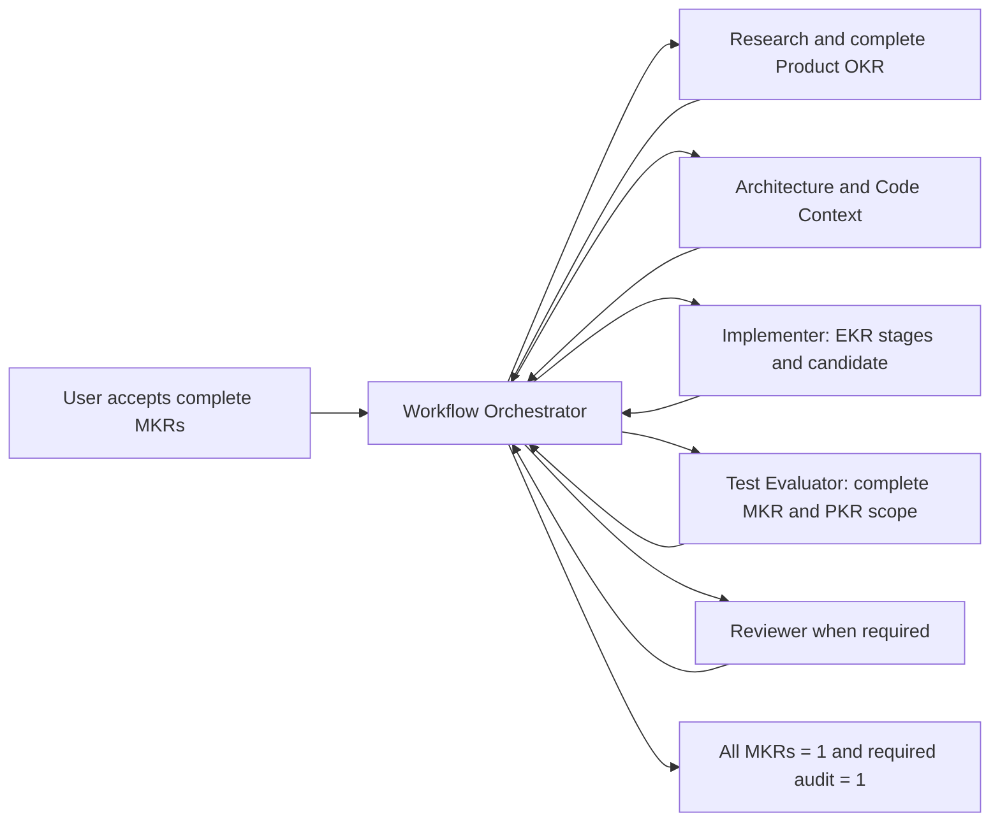

# Full Profile: Eight-Role Workflow / 八角色完整版

Use the Full Profile when a milestone benefits from separate research, product, architecture, code-context, implementation, independent-evaluation, and final-audit ownership.

当复杂或高风险 milestone 需要独立的研究、产品、架构、上下文、实现、评估和最终审计责任时，使用八角色完整版。

The Full Profile follows the shared [Dialogue Control Contract](../dialogue-control.md) and [OKR Standard](../okr-standard.md). It keeps separate professional ownership while enforcing the dependency order from complete product definition to code to independent evaluation.

八角色遵守共享[对话控制契约](../dialogue-control.md)：保留独立专业责任，但不把角色顺序或 packet 生产当成交付目标。

## Eight Roles / 八个角色

| Role | Professional ownership |
| --- | --- |
| Workflow Orchestrator / 项目经理 | Complete Milestone OKR (`MKR`), stage acceptance, routing, closure |
| Researcher / 研究员 | Complete milestone evidence base, frontier research, risks, unknowns |
| Product / PRD / 产品经理 | Complete Product OKR (`PKR`) covering every MKR |
| Architect / 架构师 | Whole-product contracts, boundaries, interfaces, data/state flow, risks |
| Code Context / 上下文工程师 | Complete PKR-to-repository mapping and implementation facts |
| Implementer / 实现工程师 | Engineering `EKR` decomposition, code, integration, regressions, complete candidate |
| Test Evaluator / 测试评估师 | Post-candidate complete MKR/PKR independent evaluation |
| Reviewer / 复核审计 | Orchestrator and role-by-role drift audit against the original milestone |

Each role uses a separate configured conversation. Every professional role returns to Workflow Orchestrator. There is no role-to-role self-routing.

每个角色使用独立对话；所有专业角色都回到项目经理；角色之间不能自行路由。

All non-Implementer roles produce governance or professional documents only. Implementer is the only role that changes target-project code under a valid assignment.

## Active Control / 活跃控制

- `milestone-contract.md` anchors the complete Objective, MKRs, evidence, non-goals, and claim boundaries.
- Orchestrator state records the current global stage and accepted artifact pointers, not Implementer EKR detail.
- One assignment-named primary professional artifact is the substantive handoff; annexes are optional.
- `handoff.manifest.json` is packet index and provenance metadata, not a completion gate.
- `ready_for_next_role` and `packet.lock.json` are optional strict-audit controls only when explicitly requested.
- Chat summaries, role self-reports, packet status, and locks do not update a KR by themselves.

## Operating Loop / 运行闭环



Workflow Orchestrator accepts one complete global stage at a time. Product / PRD is global, Implementer owns EKR decomposition, Test Evaluator starts only after candidate readiness, and every professional role returns to Workflow Orchestrator.

## Binary Rules / 二值规则

- Every accepted MKR is `0` or `1`.
- Required unrun, missing, inferred, or qualitative evidence is `0`.
- `work_unit_pass=1` means a global professional stage passed; it does not pass an MKR.
- `candidate_ready_for_independent_evaluation=1` requires every required EKR, integration check, and regression to pass.
- `evaluation_executed=1` requires the complete MKR/PKR evaluation to run; `milestone_observed_pass=1` requires every MKR to pass independently.
- `review_gate_pass=1` requires every assigned final-audit check to pass.
- `partial_pass`, `pass_with_residual_risk`, and similar gate states are invalid.

## Assignment And Return / 任务与回报

Each professional role owns exactly one `templates/assignment.md` and one `templates/return.md`. The assignment names one required primary artifact. Existing packet templates are optional section guidance or evidence annexes, not a mandatory multi-file checklist.

每个专业角色只有一份任务书模板和一份短回报模板。任务书指定一份必需的主交付物；现有 packet 模板只是可选章节指引或证据附件，不再是必须逐份完成的清单。

- [Researcher](roles/researcher/ROLE.md)
- [Product / PRD](roles/product-prd/ROLE.md)
- [Architect](roles/architect/ROLE.md)
- [Code Context](roles/code-context/ROLE.md)
- [Implementer](roles/implementer/ROLE.md)
- [Test Evaluator](roles/test-evaluator/ROLE.md)
- [Reviewer](roles/reviewer/ROLE.md)
- [Workflow Orchestrator](orchestrator/ROLE.md)

## Human Gates / 人工闸门

Human confirmation is limited to Objective/KR/threshold/dataset/grader/claim changes, budget expansion, private-data external transfer, and irreversible external actions. Routine routing, local work, packet writing, public research, and normal project Git practice do not require another Code-role approval.

## Initialize / 初始化

```bash
python scripts/init_project_workflow.py \
  --target "/absolute/path/to/project" \
  --project-name "Project Name" \
  --initial-milestone workflow-bootstrap \
  --initial-chain full-chain \
  --write
```

See [Project Bootstrap](project-bootstrap.md) and [Role Configuration Guide](role-configuration-guide.md).

## Protocols / 协议

- [Dialogue Control](../dialogue-control.md)
- [OKR Definition And Decomposition Standard](../okr-standard.md)
- [Discussion-First Protocol](discussion-first-protocol.md)
- [Role Completion Contract](role-completion-contract.md)
- [Milestone Contract](milestone-contract.md)
- [Evaluation SOP](evaluation-sop.md)
- [Handoff Protocol](handoff-protocol.md)
- [Workflow Chain Policy](workflow-chain-policy.md)
- [Role Instance Setup](role-instance-setup.md)
- [Project Bootstrap](project-bootstrap.md)
- [State Index](state-index.md), optional non-authoritative navigation
- [Project Practices](project-practices.md)
- [Git Operation Policy](git-operation-policy.md)
- [Packet Schema](packet-schema.md), optional strict-audit metadata
- [Status Transition Protocol](status-transition-protocol.md), optional strict handoff
